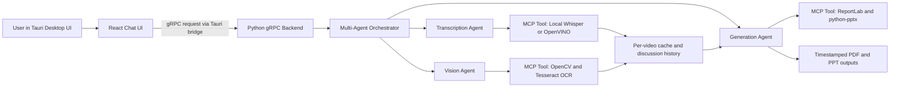
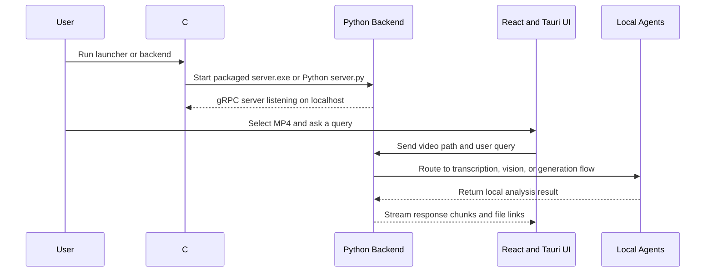

# Local Video AI Assistant

A lightweight, fully local desktop application for analyzing short MP4 videos with a conversational AI workflow. The app lets users upload local video files, ask questions in natural language, transcribe speech, inspect visual content, generate PDF/PPT summaries, and keep a persistent history of sessions.

## What this project does

- Upload and analyze local .mp4 files entirely offline
- Chat-style interaction for video understanding and summarization
- Local transcription using Whisper-style offline inference with no-speech guardrails
- Local vision analysis for object cues, graph detection, and OCR text extraction
- Generate local PDF and PowerPoint outputs with discussion context and key points
- Persist session history in the desktop app for later review

## Architecture at a glance

- Frontend: React + Vite + Tauri
- Backend: Python gRPC service with a local multi-agent orchestration layer
- AI runtime: local Whisper-based transcription with optional OpenVINO support
- Vision runtime: OpenCV heuristics + local OCR (Tesseract via pytesseract)
- Output generation: PDF via ReportLab and PowerPoint via python-pptx

### Component responsibilities

- React + Tauri desktop UI: file selection, chat interface, session history, and clarification prompts
- Tauri bridge: passes chat requests and file context from the desktop UI to the local backend
- Python gRPC backend: receives requests, keeps per-video history/cache, and routes work between local agents
- Transcription Agent: extracts audio and runs local speech-to-text
- Vision Agent: performs local object cues, OCR extraction, and graph-like visual detection
- Generation Agent: creates timestamped PDF and PPT outputs from transcript, visual findings, and discussion history
- C# launcher: starts the packaged backend executable when present, otherwise falls back to the Python backend entrypoint



### Startup sequence



## Project structure

- backend/: Python gRPC server, AI engine, MCP-style tool layer, and generated outputs
- frontend/: React UI and Tauri desktop shell
- frontend/src-tauri/: Tauri configuration and native desktop integration
- launcher/: C# console launcher for starting the backend executable or Python fallback

## Prerequisites

On Windows, install the following before running the app:

- Python 3.10+ and pip
- Node.js 20+
- Rust and Cargo
- ffmpeg available on PATH (required for Python development mode)
- Tesseract OCR (for on-screen text extraction)

If Python builds fail on Windows, install Visual Studio Build Tools or the Microsoft C++ Build Tools.

## Setup Instructions

### 1) Backend setup

Open PowerShell in the repository root:

```powershell
cd backend
python -m venv venv
.\venv\Scripts\Activate.ps1
pip install -r requirements.txt
```

Make sure ffmpeg is available on PATH. A typical Windows install is:

```powershell
ffmpeg -version
```

If ffmpeg is not found, install it and add the bin folder to your PATH.

### 1.1) OCR setup (one-time, Windows)

Install Tesseract and language data. User-level install via Scoop (no admin) is supported:

```powershell
scoop install tesseract
scoop install tesseract-languages
```

Set environment variables (persisted at user level):

```powershell
setx TESSERACT_CMD "%USERPROFILE%\scoop\shims\tesseract.exe"
setx TESSDATA_PREFIX "%USERPROFILE%\scoop\apps\tesseract-languages\current"
```

Close and reopen terminal after setting environment variables.

### 2) Frontend setup

In a new terminal:

```powershell
cd frontend
npm install
```

### 3) Start the backend (recommended first)

From the backend folder:

```powershell
.\venv\Scripts\python.exe server.py
```

The backend will start a local gRPC server on localhost.

This is the simplest development path when you are changing Python code and want to avoid rebuilding the packaged executable.

### 4) Run the desktop app

In a separate terminal:

```powershell
cd frontend
npm run tauri dev
```

`npm run tauri dev` is the main desktop workflow and is sufficient by itself for normal development.

### 5) Optional web-only frontend mode

Use this only when you want to work on the React UI without the Tauri shell:

```powershell
cd frontend
npm run dev
```

### 6) Optional C# launcher

The repository now includes a small C# launcher that starts the packaged backend executable when available, or falls back to `backend/server.py` with the local virtual environment Python.

```powershell
dotnet run --project launcher/BackendLauncher.csproj
```

The launcher project currently targets `.NET 10`, so the machine running it needs a compatible .NET SDK/runtime installed.

Launcher behavior:

- First choice: `backend/venv/Scripts/python.exe backend/server.py`
- Fallback: `backend/dist/server/server.exe`

This default favors development stability for transcription dependencies while still supporting packaged backend fallback.

Recommended launcher command:

```powershell
dotnet run --project c:\yhchiam\local-video-ai-assistant\launcher\BackendLauncher.csproj
```

### 7) Package the backend executable

From the repository root, build the Windows backend executable with:

```powershell
cd backend
.\build_backend_exe.ps1
```

That script installs packaging dependencies into the backend virtual environment and produces:

```text
backend/dist/server/server.exe
```

The packaged build also bundles the repository-local `backend/ffmpeg/bin` tools so the executable can continue extracting audio without requiring a separate system `ffmpeg` installation.

After that, you can run the packaged backend directly:

```powershell
cd backend
.\dist\server\server.exe
```

Or use the launcher, which will automatically prefer the packaged executable:

```powershell
dotnet run --project launcher/BackendLauncher.csproj
```

Recommended usage:

- Use `python server.py` during active backend development
- Use `server.exe` when you want a packaged handoff/demo build
- Use the C# launcher when you want a single desktop-friendly entrypoint that can handle either mode

### 8) Quick start (daily usage)

For most runs, open two terminals:

Terminal 1 (backend):

```powershell
dotnet run --project c:\yhchiam\local-video-ai-assistant\launcher\BackendLauncher.csproj
```

Terminal 2 (desktop app):

```powershell
cd c:\yhchiam\local-video-ai-assistant\frontend
npm run tauri dev
```

Do not run `cargo run` manually for normal usage. `npm run tauri dev` handles the Tauri side.

## Example queries

You can try prompts such as:

- “Transcribe the video.”
- “Create a PowerPoint with the key points discussed in the video.”
- “What objects are shown in the video?”
- “Are there any graphs in the video? If yes, describe them.”
- “Summarize our discussion so far and generate a PDF.”

For low-confidence requests, the app may ask for clarification, for example:

- “Did you mean Transcribe, Visual Analysis, PowerPoint, or PDF Summary?”
- “Can you provide more details?”

## Generated outputs

Generated outputs are written to the backend output folder using meaningful timestamped names so older files are preserved:

- backend/outputs/video_analysis_report_<video-name>_<timestamp>.pdf
- backend/outputs/video_key_points_presentation_<video-name>_<timestamp>.pptx

Example naming pattern:

- `video_analysis_report_privacy_talk_20260706_194222.pdf`
- `video_key_points_presentation_privacy_talk_20260706_194222.pptx`

## Assignment Requirement Mapping

| Assignment requirement | Status | Implemented in |
|---|---|---|
| Select and upload local `.mp4` files | Done | `frontend/src/App.jsx` (native file picker and video path binding) |
| Natural language interaction for video querying | Done | `frontend/src/App.jsx`, `backend/server.py` |
| Transcribe the video | Done | `backend/ai_engine.py`, `backend/mcp_server.py`, `backend/server.py` |
| Create PowerPoint with key points | Done | `backend/mcp_server.py`, `backend/server.py` |
| What objects are shown in the video | Done | `backend/ai_engine.py`, `backend/server.py` |
| Detect and describe graph-like visuals | Done (heuristic) | `backend/ai_engine.py`, `backend/server.py` |
| Summarize discussion so far and generate PDF | Done | `backend/server.py`, `backend/mcp_server.py` |
| Human-in-the-loop clarification for ambiguous routing | Done | `backend/server.py`, `frontend/src/App.jsx` |
| Persistent chat history after restart | Done | `frontend/src/App.jsx` (localStorage session persistence) |
| React + Tauri desktop frontend | Done | `frontend/src/App.jsx`, `frontend/src-tauri/src/main.rs` |
| Backend communication via gRPC | Done | `backend/server.py`, `backend/schema.proto`, `frontend/src-tauri/src/lib.rs` |
| Multi-agent orchestration with MCP-style tool layer | Done | `backend/server.py`, `backend/mcp_server.py` |
| Fully local inference (no cloud calls) | Done | `backend/ai_engine.py`, local tools in `backend/mcp_server.py` |
| C# launcher for packaged backend | Done | `launcher/Program.cs`, `launcher/BackendLauncher.csproj` |
| Packaged backend executable flow (PyInstaller) | Done | `backend/server.spec`, `backend/build_backend_exe.ps1` |
| Submission sample inputs/outputs committed in repo | Pending assets | Add sample MP4(s) and generated PDF/PPTX files under versioned folders |

## Submission folder layout

Use the prepared submission workspace at `submission/` for final handoff assets.

```text
submission/
	README.md
	input-videos/
		.gitkeep
	generated-outputs/
		pdf/
			.gitkeep
		pptx/
			.gitkeep
	docs/
		.gitkeep
	checklist/
		final-summary.md
```

Readme snippet for reviewers:

```markdown
Submission assets are organized under `submission/`:

- `submission/input-videos/`: example source MP4 clips used for testing.
- `submission/generated-outputs/pdf/`: generated PDF reports.
- `submission/generated-outputs/pptx/`: generated PowerPoint decks.
- `submission/checklist/final-summary.md`: final summary of what works, limitations, challenges, and future improvements.
```

Before submission, replace `.gitkeep` placeholders with real sample assets.

## What works

- Local MP4 selection from disk
- Chat-style UI for entering video analysis requests
- Persistent session/history storage in the app
- Local transcription flow with no-speech filtering (avoids false short outputs)
- Vision Agent with:
	- object cues (speaker, dashboard-like scene, flag-like region)
	- graph detection (heuristic chart-like visual detection)
	- OCR text extraction (when Tesseract is installed/configured)
- PowerPoint generation with key points from transcript/vision context
- PDF generation with "discussion so far" summary context
- Clarification-style routing for ambiguous requests
- Tauri desktop shell integration

## What remains / recommended next steps

- Improve the vision pipeline with stronger model-based detection (beyond heuristics)
- Add sample video input(s) and generated PDF/PPTX output artifacts for final submission packaging
- Validate the full flow on additional real-world MP4 files

## Submission checklist

- [x] Complete source code for frontend and backend
- [x] React + Tauri desktop UI with persistent local chat history
- [x] Python backend with local gRPC communication and agent-style routing
- [x] Local transcription, vision analysis, PDF generation, and PowerPoint generation
- [x] Human-in-the-loop clarification for ambiguous routing
- [x] Clear setup and execution instructions
- [x] Architecture diagram in the repository documentation
- [x] C# launcher scaffold for backend startup
- [x] Delivery summary covering what works, what does not, challenges, and future improvements
- [x] Example input video files committed in the repository
- [x] Sample generated PDF and PPT outputs committed in the repository

The unchecked items are the remaining submission artifacts rather than missing product functionality.

## Delivery summary

- What works: local MP4 selection, offline transcription, OCR-assisted visual analysis, report generation, persistent history, and HITL clarification routing.
- What does not fully work yet: the vision stack still relies on lightweight heuristics rather than stronger model-based object and graph understanding.
- Challenges encountered: Windows environment setup for ffmpeg and Tesseract, no-speech hallucinations from small Whisper models, and reducing graph false positives on speaker-only videos.
- With more time: strengthen model quality for vision tasks, add curated sample assets for a cleaner final submission, and expand automated packaging validation.

## Troubleshooting

- Packaged backend does not start:
	- Rebuild it with `cd backend` then `.\build_backend_exe.ps1`
	- Confirm the expected file exists at `backend/dist/server/server.exe`
	- If the launcher prints that it used the packaged fallback unexpectedly, verify your backend virtual environment exists at `backend/venv/Scripts/python.exe`
	- If the launcher fails before startup, confirm the installed .NET runtime matches the target framework in `launcher/BackendLauncher.csproj`
	- If OCR is required, confirm `TESSERACT_CMD` and `TESSDATA_PREFIX` are still set in your user environment before launching the exe

- OCR text is always empty:
	- Confirm Tesseract binary exists and is callable:
		- `tesseract --version`
	- Confirm environment variables:
		- `echo $env:TESSERACT_CMD`
		- `echo $env:TESSDATA_PREFIX`
	- Restart backend in a fresh terminal after any env changes.

- Transcription returns very short filler text:
	- The backend now treats low-confidence short outputs as no speech.
	- If needed, re-run after restarting backend to ensure latest logic is active.

- Vision reports stale or unexpected values:
	- Restart backend to clear in-memory cache and apply latest detector logic.

## Notes

The current offline workflow is intentionally lightweight and practical for local development. It prioritizes running on a typical developer machine with CPU-only inference, using a small local Whisper model for transcription and local generation tools for reports.
